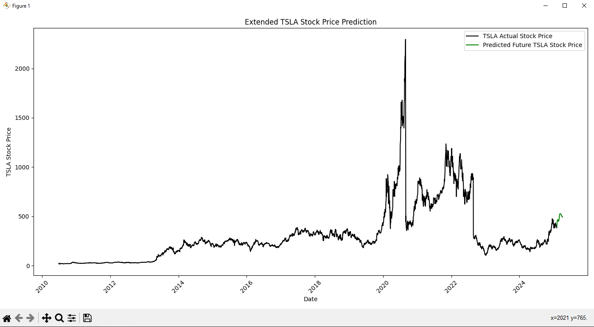

# StockMachineLearning  

## Overview  
**StockMachineLearning** is a machine learning program that fetches historical stock data and uses a **Long Short-Term Memory (LSTM)** neural network to predict stock prices.  

The program allows users to enter **any stock symbol**, retrieves real-time data using the **Alpha Vantage API**, and generates a graph displaying **historical stock data** alongside **predicted prices for the next 60 days**.  

## Features  
- **Fetches historical stock data** for any stock symbol  
- **Preprocesses and normalizes data** using MinMaxScaler  
- **Trains an LSTM-based neural network** with dropout and bidirectional layers  
- **Implements EarlyStopping** to optimize model performance  
- **Generates a matplotlib visualization** comparing actual vs. predicted prices  

## Installation  
Ensure you have **Python 3.x** installed, then install the required dependencies:  

```sh
pip install numpy pandas matplotlib scikit-learn tensorflow requests
```

## Usage  
Run the script:  

```sh
python main.py
```

This will:  
1. **Prompt you to enter a stock symbol**  
2. **Fetch the stock's historical data**  
3. **Train the LSTM model**  
4. **Generate a graph with predictions**  

## Dependencies  
- **NumPy** – Numerical computations  
- **Pandas** – Data manipulation  
- **Matplotlib** – Data visualization  
- **scikit-learn** – Data preprocessing  
- **TensorFlow/Keras** – Machine learning  
- **Requests** – Fetching stock data from Alpha Vantage  

## Example Output  
  


## License  
This project is **open-source**, and you are free to use or modify it for personal or educational purposes.  
